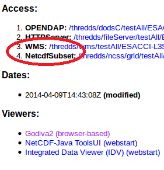
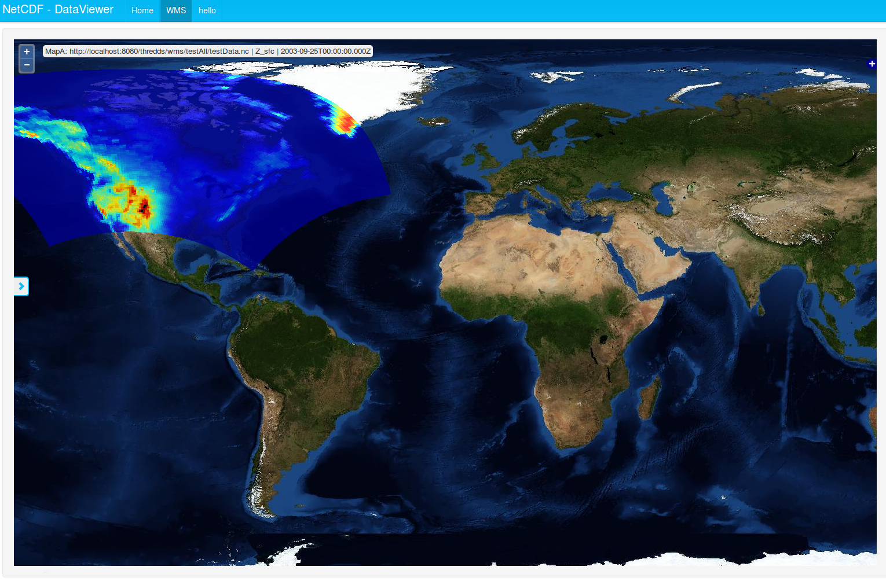
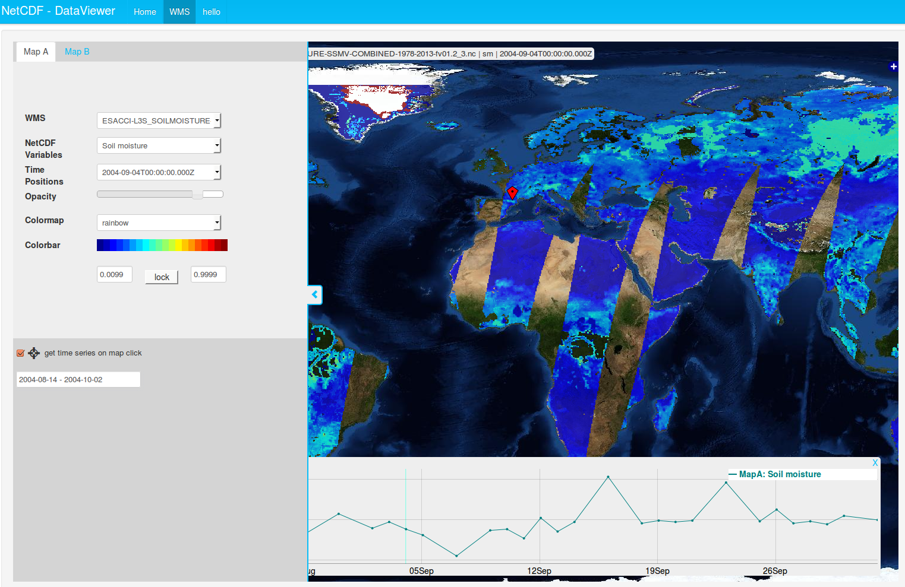
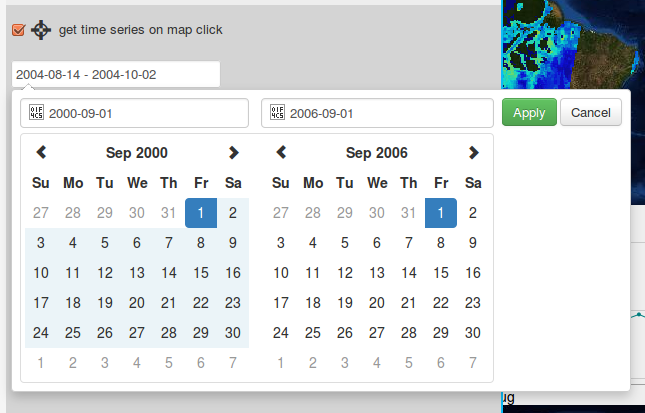
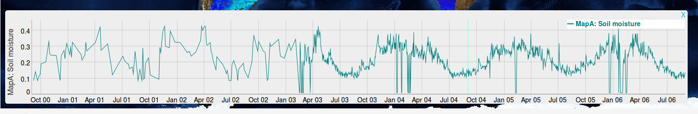

ncweb
=====

Flask application for viewing netCDF data on a map

ncweb is a viewer that allows to view netCDF files that are hosted on a [THREDDS](https://github.com/Unidata/thredds) server. ncweb can also create timeseries for single locations with varying timespans. 

Install
-------

ncweb runs with Python 2.7 and needs several packages (see [requirements](requirements.txt))

### THREDDS

To install THREDDS and dependencies (Java, Tomcat) follow the
[official tutorial](http://www.unidata.ucar.edu/software/thredds/v5.0/tds/tutorial/GettingStarted.html)

Setup
-----

In THREDDS the WMS and the netCDF subset service need to be enabled. For this follow these [instructions](http://www.unidata.ucar.edu/software/thredds/current/tds/reference/ThreddsConfigXMLFile.html#WMS).
ncweb searches all files that are included in the default catalog.xml (.../apache-tomcat-7.0.63/content/thredds/catalog.xml). In the <satasetScan> tag a directory can be specified that is automatically scanned for netCDF files. 
```
  <datasetScan name="Test all files in a directory" ID="testDatasetScan" path="testAll" location="content/testdata">
    <metadata inherited="true">
      <serviceName>all</serviceName>
      <dataType>Grid</dataType>
    </metadata>
    <filter>
      <include wildcard="*.nc"/>
    </filter>
  </datasetScan>
```

If setup like in the example the files should be put in this folder: .../apache-tomcat-7.0.63/content/thredds/public/testdata

Quickstart
----------

Once everything is installed and setup you can go ahead and try ncweb. First start the THREDDS server. To test if it is running correctly open the catalog at http://localhost:8080/thredds/catalog.html. Check if your data is available and make sure the WMS and netCDF subset service are enabled for your dataset by clicking on your catalog and then file.


To start ncweb you need to run app.py by default it should be running on port 5000  [http://localhost:5000/wms](http://localhost:5000/wms) (tested in Firefox and Chrome)

You should be looking at this now: 



Now feel free to look at all your datasets, just choose the WMS Layer, the variable, timeposition, and styling. These options can all be found in the sliding menu on the left.

#### Timeseries

If you are using a dataset with data for multiple dates you can create a timeseries for a single location. First enable the selection tool in the sliding menu and then click on the map for the specific location you are interested in. Once you have selected a location the timeseries plot will appear at the bottom of the screen.



By default the timeseries covers the timerange from a month before and a month after the scene you are looking at at the moment. This can be easily adapted, by clicking on the date field and then manually selecting the desired date range. 



Once you click **Apply** the timeseries will be updated. Longer dateranges might take a while to load!



Advanced
--------

#### Colorbar

There are serveral colorschemes available for the vizualization of your data. They can easily selected in the drop-down menu. For the scaling by default the min and max value are used. To change this just type a different value in the text fields. To make sure the color scaling doesn't change again afterwards click the **lock** button. No matter what you change now the scale will remain the same. To change it just click **unlock**.

#### Map B

In ncweb it is also possible to view more than one dataset at the same time. At the top of the sliding menu you can choose Map B. Here you can select another scene to be shown. 

Once Map B is enabled as an overlay the timeseries will automatically include both datasets. In split screen mode two seperate timeseries plots will appear.
