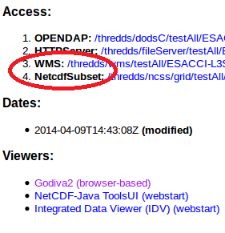

ncweb
=====

Flask application for viewing netCDF data on a map

ncweb is a viewer that allows to view netCDF files that are hosted on a [THREDDS](https://github.com/Unidata/thredds) server. ncweb can also create timeseries for single locations with varying timespans. 

Install
-------

ncweb runs with Python 2.7 and needs several packages (see [requirements](requirements.txt))
THREDDS needs to be installed 

Setup
-----

In THREDDS the WMS and the netCDF subset service need to be enabled. For this follow these [intructions](http://www.unidata.ucar.edu/software/thredds/current/tds/reference/ThreddsConfigXMLFile.html#WMS)
ncweb searches all files that are included in the default catalog.xml (.../apache-tomcat-7.0.63/content/thredds/catalog.xml). In the <satasetScan> tag a directory can be specified that is automatically scanned for netCDF files. 
```
  <datasetScan name="Test all files in a directory" ID="testDatasetScan" path="testAll" location="content/testdata">
    <metadata inherited="true">
      <serviceName>all</serviceName>
      <dataType>Grid</dataType>
    </metadata>
    <filter>
      <include wildcard="*.nc"/>
    </filter>
  </datasetScan>
```

If setup like in the example the files should be put in this folder: .../apache-tomcat-7.0.63/content/thredds/public/testdata

Quickstart
----------

Once everything is installed and setup you can go ahead and try ncweb. First start the THREDDS server. To test if it is running correctly open the catalog at http://localhost:8080/thredds/catalog.html. Check if your data is available and make sure the WMS and netCDF subset service are enabled for your dataset by clicking on your catalog and then file.


To start ncweb you need to run app.py by default it should be running on port 5000  [http://localhost:5000/wms](http://localhost:5000/wms)


